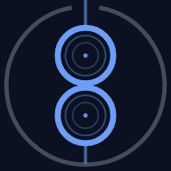

<p align="center">
  
</p>

<h3 align="center">daemon8</h3>

<p align="center">
  Runtime awareness management for AI agents.<br>
  <em>Everything stays on your machine.</em>
</p>

<p align="center">
  <a href="https://daemon8.ai">Website</a> ·
  <a href="https://daemon8.ai/docs">Docs</a> ·
  <a href="https://github.com/daemon8ai/daemon8/discussions">Discussions</a>
</p>

---

Daemon8 is a local observation daemon that collects runtime data from your browser, devices, and applications into a single stream. AI coding agents connect over MCP and get query, subscribe, and act capabilities in one place.

No cloud. No account. No telemetry.

## Install

```bash
cargo install --git https://github.com/daemon8ai/daemon8 daemon8
```

macOS — sign the binary so Gatekeeper and launchd accept it:

```bash
codesign --force --sign - ~/.cargo/bin/daemon8
```

Register as a system service and configure your AI clients:

```bash
daemon8 install
daemon8 setup
```

`daemon8 install` registers a user-level service (launchd on macOS, systemd on Linux, Task Scheduler on Windows). `daemon8 setup` detects your browser and auto-configures Claude Code, Cursor, Windsurf, Gemini CLI, and Codex.

> [!WARNING]
> **macOS:** first launch triggers an "unidentified developer" Gatekeeper prompt
> and may request Background Items and App Management permissions. Both are
> expected until signed release binaries ship. The daemon is entirely local.

## Verify

```bash
daemon8 status
daemon8 doctor
```

## MCP tools

Any MCP client connects to `http://localhost:8888/mcp`. Fourteen tools are exposed:

| Tool | Purpose |
|------|---------|
| `query_observations` | Query observations by kind, severity, origin, text, tags, or checkpoint. |
| `status` | Health snapshot: error rate, sources, observation count, version. |
| `create_checkpoint` | Mark current stream position; subsequent queries resume from it. |
| `list_connections` | List active ingestion sources and browser connection state. |
| `connect_browser` | Point the daemon at a Chrome DevTools Protocol endpoint. |
| `issue_command` | Browser/device actions: eval JS, screenshot, CSS inject, storage, navigate. |
| `ingest_observation` | Record an observation from inside the agent loop. |
| `subscribe_observations` | Subscribe to a filtered real-time alert stream (severity >= warn by default). |
| `set_lens` | Create a per-session reactive filter with a ring buffer (up to 1000). |
| `clear_lens` | Remove the active lens. |
| `lens_status` | Inspect the current lens filter and buffer state. |
| `save_memory` | Persist a memory entry (user-flagged, pattern, insight, etc.). |
| `query_memory` | Search stored memories by kind, tags, project, or text. |
| `forget_memory` | Delete a memory entry by ID. |

## CLI

| Command | Description |
|---------|-------------|
| `daemon8 serve` | Start the daemon server (default when no subcommand given). |
| `daemon8 status` | Show daemon health and status. |
| `daemon8 tail` | Stream observations in real-time. |
| `daemon8 query` | Query stored observations. |
| `daemon8 connections` | List active data source connections. |
| `daemon8 browser` | Browser DevTools commands. |
| `daemon8 lens` | Manage per-session observation lens. |
| `daemon8 logs` | Show log file location or tail logs (`--follow`). |
| `daemon8 config` | Show or modify configuration. |
| `daemon8 completions` | Generate shell completions. |
| `daemon8 install` | Install as a system service. |
| `daemon8 uninstall` | Remove the system service. |
| `daemon8 setup` | Interactive first-run wizard. |
| `daemon8 channel` | Real-time alert relay for Claude Code (experimental). |
| `daemon8 agent` | Run a stateless background or one-shot agent. |
| `daemon8 doctor` | Diagnose configuration and environment issues (`--fix` to auto-repair). |
| `daemon8 init` | Scaffold a `.daemon8.toml` in the current project. |

## Ingestion

Send observations from any language over HTTP:

```bash
curl -X POST http://localhost:8888/ingest -H 'Content-Type: application/json' -d '{"kind":"query","severity":"info","app":"my-api","data":{"sql":"SELECT * FROM users","duration_ms":3.2}}'
```

Batch endpoint: `POST /ingest/batch` (JSON array). UDP listener on port 8889.

## SDKs

| Package | Language | Install |
|---------|----------|---------|
| [`daemon8/php`](https://github.com/daemon8ai/daemon8-php) | PHP | `composer require daemon8/php` |
| [`daemon8/laravel`](https://github.com/daemon8ai/daemon8-laravel) | Laravel | `composer require daemon8/laravel` |
| [`daemon8/symfony`](https://github.com/daemon8ai/daemon8-symfony) | Symfony | `composer require daemon8/symfony` |

## Architecture

Ten crates in a Cargo workspace:

| Crate | Purpose |
|-------|---------|
| `daemon` | CLI binary and command dispatch. |
| `types` | `Observation`, `Filter`, `Kind`, `Origin`, `Severity` — shared types. |
| `store` | `SurrealStore` (embedded SurrealDB) + `LensManager` ring buffer. |
| `api` | Axum HTTP routes: ingest, observe, stream, checkpoint, connections, lens, health. |
| `mcp` | MCP server: 14 tools across observe, action, lens, and memory routers. |
| `ingest` | HTTP, UDP, and Unix socket ingest routers + normalization. |
| `chrome` | Chrome DevTools Protocol bridge (raw WebSocket). |
| `adb` | Android Debug Bridge device transport. |
| `embed` | Embedding support (fastembed). |
| `parse` | Observation parsing and extraction. |

## Contributing

Read [`CONTRIBUTING.md`](./CONTRIBUTING.md) before sending a PR. [`TODO.md`](./TODO.md) and the testing gauntlet in [`TESTING.md`](./TESTING.md) are good-first-issue friendly.

By participating, you agree to the [Code of Conduct](./CODE_OF_CONDUCT.md).

## License

[Fair Core License 1.0 with Apache 2.0 Fallback](LICENSES/FCL-1.0-ALv2.txt) (FCL-1.0-ALv2). Full rights for internal use, education, research, and professional services. Restricts competing use. Each release relicenses under Apache 2.0 two years after publication.

DAEMON8 is a trademark of Havy.tech, LLC.

## Contact

- **General / security:** mail@daemon8.ai
- **Discussion:** [GitHub Discussions](https://github.com/daemon8ai/daemon8/discussions)
- **Bugs / features:** [Issues](https://github.com/daemon8ai/daemon8/issues)

Copyright 2026 Havy.tech, LLC.
