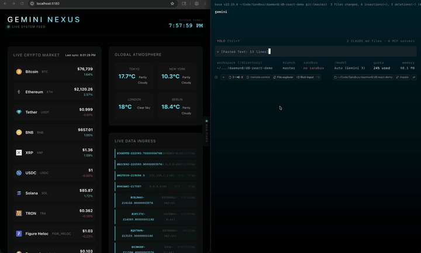
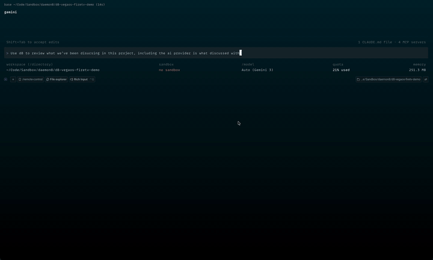

<p align="center">
  <picture>
    <source media="(prefers-color-scheme: dark)" srcset="https://raw.githubusercontent.com/daemon8ai/daemon8/main/mark-dark.svg">
    <source media="(prefers-color-scheme: light)" srcset="https://raw.githubusercontent.com/daemon8ai/daemon8/main/mark-light.svg">
    
  </picture>
</p>


# daemon8

> Look useful? Consider starring the repo.
>
> Follow along on X: [](https://x.com/j_havenz)

daemon8 gives AI coding agents situational awareness while the work is happening.

AI agents are strongest when they can work from evidence: what the app is doing, what the browser reported, what another provider already tried, and what changed after a fix. daemon8 creates that layer locally. It centralizes runtime signals, recent provider activity, and debugging structure so agents can keep moving without guessing.

<table>
  <tr>
    <td align="center" valign="top" width="50%">
      <a href="assets/vids/d8-browser-fix-demo.mov">
        
      </a>
      <p><strong>Browser Debugging</strong></p>
      <p>Four browser-visible errors: one mobile styling issue plus JavaScript and network failures. daemon8 gives the agent direct browser control and a live view of runtime state, then a Vite panel subscribed to the SurrealDB-backed stream shows each fix as it lands.</p>
      <p><sub>Paired with Gemini, this loop gets fast. Almost like they were made by the same company or something.</sub></p>
    </td>
    <td align="center" valign="top" width="50%">
      <a href="assets/vids/d8-vegaos-convo-catchup.mov">
        
      </a>
      <p><strong>Conversation Catch-up</strong></p>
      <p>A fresh session catches up from recent provider transcripts and builds a faceted project snapshot before continuing the work.</p>
      <p><sub>Cross-provider recovery across Claude, Codex, and Gemini context.</sub></p>
    </td>
  </tr>
</table>

## What daemon8 does

Put simply: daemon8 is an awareness layer for human-in-the-loop, agentic development.

It gives agents focused knowledge of what is happening right now and peripheral knowledge of what has already happened in the project (and any related project(s), e.g. frontend/backend). App logs, browser events, debug checkpoints, open investigations, and recent conversations **across AI providers** become one cohesive field of context the agent can query instead of guessing.

**This matters because AI coding tools still live in provider-shaped rooms**. Claude has one view of the work. Codex has another. Gemini has another. daemon8 starts stitching those views together with the live runtime state of the project. For this alpha, the core path is MCP-first and source-driven; provider integration utilities exist, but they are not the runtime foundation.

It gives agents one place to ask:

- What's been discussed recently in this project? (across Gemini, Codex, and Claude)
- What just happened in the app?
- What changed after this checkpoint?
- What is the browser doing right now?
- What did Claude, Codex, or Gemini already try?
- What recent project context should I know before touching this?
- Which debug sessions are still open, abandoned, or resolved?

## Alpha Release

My blue-sky goals are larger than this alpha release represents. Situational awareness is the first foundation for a broader, provider-agnostic cortex for AI agents. The details and planned features will come in time.

This alpha is that foundation. Not the whole vision yet. The point is better loops today: observe, change, verify, remember.

## Install

macOS and Linux:

```bash
curl -fsSL https://daemon8.ai/install.sh | bash
```

Windows PowerShell:

```powershell
iwr https://daemon8.ai/install.ps1 -UseB | iex
```

The installer downloads the release, verifies a checksum, installs the `daemon8` binary, registers daemon8 as a user-level service, and can add daemon8 MCP settings for Claude Code, Gemini CLI, and Codex.

> [!IMPORTANT]
> Finish the instruction-file step during install. This is _the one place_ daemon8 needs manual setup from you: let the installer add the daemon8 instruction block to your global agent instruction files (`CLAUDE.md`, `AGENTS.md`, `GEMINI.md`), or choose print/copy and add it yourself. That standing instruction is what makes agents connect first, use daemon8 for logs/browser/conversation state, and run the checkpointed debug loop instead of falling back to guessing.

After install, start a fresh AI CLI session. daemon8 runs locally as a machine-wide MCP server, so supported agents can talk to the same daemon across projects.

A browser extension is _not_ required. daemon8 has its own purpose-built Chromium integration using CDP (Chrome DevTools Protocol).

## First project setup

> daemon8 supports Gemini CLI, not `agy` yet.

Start in a fresh Claude Code, Codex, or Gemini CLI session after install. The `daemon8` MCP server should already be available because the installer configured the provider for you.

> [!NOTE]
> Claude Code installs can also include `daemon8-channel`. That channel is experimental and requires an explicit launch flag. It's an SSE path for real-time communication between harnesses; useful for experiments, but not required for normal daemon8 usage.

Then ask the agent to connect this project to daemon8:

```text
Connect this project to daemon8 and follow any setup instructions it returns.
```

The agent should call `daemon8_connect` first. If daemon8 says the project needs setup, the agent should call `daemon8_init` or run:

```bash
daemon8 init
```

That creates a project-local `.daemon8/config.md`.

Open that file once and check the `sources` section. This is where daemon8 learns which project logs, build outputs, and runtime files matter. If the project produces log output, it should be registered there.

The important fields for a log source are:

```yaml
sources:
  - id: app.logs
    service: app
    kind: file
    path: "$PRJ_ROOT/logs/app.log"
    parser: auto
    tags: ["app"]
```

Use `parser: auto` when you are not sure yet. Pick a more specific parser once you know the log format.

After that, you should see daemon8 show up naturally during non-trivial debugging: reading observations, checkpointing before changes, checking browser state, and catching up on recent conversation context when needed.

<details>
  <summary>Log parsers currently supported</summary>

| Parser | Use it for |
|---|---|
| `auto` | Default first try when you are unsure. It attempts JSON, syslog, Monolog, Common/Combined Log Format, logfmt, then falls back to plain line parsing. |
| `line` | Plain text logs. Preserves the full line and sniffs severity words like `ERROR`, `WARNING`, `DEBUG`, and `FATAL`. |
| `json` | One JSON object per line. Reads common fields like `timestamp`/`ts`/`time`, `level`/`severity`, `msg`/`message`, and `channel`/`logger`. |
| `monolog` | PHP/Laravel Monolog-style lines such as `[2024-01-15 14:32:01] app.ERROR: message {...} []`. |
| `syslog` | RFC3164/RFC5424-style syslog lines, including facility/severity, hostname, app name, pid, and msgid when present. |
| `logfmt` | Key/value logs like `ts=... level=warn msg="memory pressure" used_mb=3800`. |
| `clf` | Web server Common Log Format and Combined Log Format. Status codes map to info/warn/error severity. |
| `grok` | Custom Grok pattern. Set `parser: grok` and add `parser_pattern` on the source entry. |

Custom parser TOML files can also be loaded from daemon8's parser config directory, but the built-ins above are the alpha path to start with.
</details>

---

## Real-time subscriptions

daemon8 is not only for agents. Frontends, harnesses, dashboards, and test tools can subscribe to tagged slices of the same local observation feed while work is happening.

Observations are persisted in daemon8's local SurrealDB-backed runtime store, then streamed through `GET /api/stream` as Server-Sent Events. That gives a UI one path for live updates and reconnect replay while an agent works, a browser repro runs, or a chaos harness injects failures.

```ts
const params = new URLSearchParams({
  tags: "demo:chaos,project:react-chaos",
  severity_min: "info",
});

const feed = new EventSource(`/daemon8/api/stream?${params}`);

feed.onmessage = (event) => {
  const observation = JSON.parse(event.data);
  console.log(observation);
};
```

Tag filters are conjunctive: `tags=demo:chaos,project:react-chaos` only returns observations carrying both tags. The daemon endpoint is local at `http://localhost:8888`; browser frontends commonly route it through a same-origin dev-server proxy like `/daemon8`.

> [!NOTE]
> Native agents, CLIs, and local tools can call `http://localhost:8888` directly. Browser apps are the exception: during Vite development, proxy `/daemon8` through the dev server so frontend code stays same-origin.

```ts
// vite.config.ts
export default {
  server: {
    proxy: {
      "/daemon8": {
        target: "http://localhost:8888",
        changeOrigin: true,
        rewrite: (path) => path.replace(/^\/daemon8/, ""),
      },
    },
  },
};
```

---

## Short-lived working set

daemon8 treats raw runtime context as a short-lived working set.

Observations, screenshots, and generated conversation snapshots are kept for roughly 24 hours. After that, they become eligible for the background cleanup sweep. The sweep runs periodically, so cleanup is not exact to the minute. In this alpha, that retention window is fixed.

Observations attached to an active debug session are protected while the session is active. If the agent forgets to close the session, daemon8 can auto-end the inactive session and write a thin summary before those observations become eligible for cleanup.

The durable layer is the thing you want to keep: resolved debug-session summaries, memory records, source configuration, and whatever you intentionally save outside the raw feed.

That split is intentional. The raw feed is the scratchpad. The summary is the memory.

---

## Suggested alpha demos

These are the scenarios I plan to use for the first recordings:

- Break JavaScript in a frontend app and let daemon8 guide the agent through browser state, logs, checkpoints, and the fix. If Claude Code is involved, be explicit that it should use daemon8 for browser work, not Claude for Chrome.

- Return an API error and let daemon8 surface the failure through browser network activity and app/runtime observations.

- Stop a terminal session running one provider, start another provider, and ask it to catch up on the recent conversation.

- Save a message to the daemon8 feed, then ask another agent working in the same project to read the recent feed messages.

- Start a harness in your frontend and tell it to link that conversation to a backend project.

---

## Core capabilities

| Capability | What the agent gets |
|---|---|
| Live observations | Logs, exceptions, metrics, browser events, device events, and custom app telemetry in one feed. |
| Lenses | A focused filter with a small ring buffer, so the agent can keep watching one slice. |
| Checkpoints | A before/after marker for reproductions, patches, tests, and user verification. |
| Debug sessions | A durable investigation record with checkpoints, status, outcome, and summary memory. |
| Conversation snapshots | Faceted summaries of recent Claude, Codex, and Gemini transcripts. |
| Browser control | DevTools actions exposed to the agent: eval, screenshot, DOM, storage, viewport, navigation, and network conditions. |
| Local API | HTTP ingest, query, stream, connections, lenses, browser actions, and MCP over localhost. |

## CLI

Useful checks:

```bash
daemon8 status
daemon8 connections
daemon8 logs --follow
```

Common project commands:

```bash
daemon8 init
daemon8 connect --path . --provider codex
daemon8 query --severity error
daemon8 tail
```

Browser commands are available from the CLI too:

```bash
daemon8 browser tabs
daemon8 browser screenshot --output screenshot.png
daemon8 browser eval "document.title"
```

## MCP tools

The MCP surface is the main interface for agents.

| Tool | Purpose |
|---|---|
| `daemon8_connect` | Bind the session to a project or general scope. |
| `daemon8_init` | Create `.daemon8/config.md` when a project needs setup. |
| `read_live_feed` | Read observations with filters, tags, sources, severity, text, or checkpoint bounds. |
| `write_to_live_feed` | Write agent notes, app events, metrics, exceptions, or custom signals. |
| `set_lens` / `lens_status` / `clear_lens` | Keep a focused watch on matching observations. |
| `start_debug_session` | Open a named investigation. |
| `create_checkpoint` | Mark the observation sequence before a repro, patch, or verification step. |
| `resolve_debug_session` | Close the loop with root cause, fix summary, commands, and related errors. |
| `link_conversation` | Attach a provider transcript to the current project session. |
| `build_context_snapshot` | Build markdown facets from recent conversation history. |
| `list_connections` | See browser, app, and device sources currently connected. |
| `connect_browser` | Point daemon8 at a Chromium DevTools endpoint. |
| `issue_command` | Run browser or device actions. |
| `daemon8_status` / `daemon8_help` | Orient the agent when it needs current state or tool guidance. |

Responses use a common alpha envelope with `status`, `code`, `message`, `data`, `requirements`, `hints`, and `next_actions`. The envelope is part of the workflow; agents are expected to follow it.

## HTTP API

The daemon serves local endpoints for direct integrations:

| Route | Purpose |
|---|---|
| `GET /health` | Health check. |
| `POST /ingest` | Write one observation. |
| `POST /ingest/batch` | Write multiple observations. |
| `GET /api/observe` | Query stored observations. |
| `GET /api/stream` | Stream observations over SSE. |
| `GET /api/connections` | Inspect browser and app connection state. |
| `GET /api/lens`, `PUT /api/lens`, `DELETE /api/lens` | Inspect, set, or clear the observation lens. |
| `POST /api/connect` | Connect a browser DevTools endpoint. |
| `POST /api/browser/act` | Run a browser or device action. |
| `POST /mcp` | Streamable HTTP MCP transport. |

_SDKs are on the roadmap_

## Development

From a checkout:

```bash
cargo install --path crates/daemon
```

For development:

```bash
cargo check --workspace
cargo test --workspace
```
